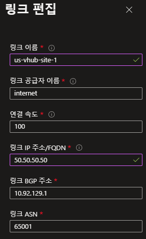

# terraform-fortios-vpn-bgp-sdwan
Terraform으로 FortiGete 장비에서 Azure VPN Gateway와 IPsec VPN 연동, BGP 라우팅 연동, SDWAN 구성하는 방법입니다.

> ### Diagram

> ### Provider 설정

[ Terraform과 FortiOS 연동 ](https://github.com/20eung/terraform-fortios-howto) 바로가기

> ### main.tf 설명

모듈 module 로 호출
변수로 다음 정보를 전달함

* Azure VPN 정보
* US Site 정보
* SDWAN에서 SLA 측정을 하기 위한 Azure 서버 IP 정보

---
> ### modules/vpn.tf 설명

* FortiOS를 사용하려면 module 에서도 provider 설정이 필요합니다.
* Azure VPN 연동 권장 설정

|설정|Phase 1 권장 값|
|-----------|---------|
|IKE Version|2|
|dpd|on-idle|
|keylife|28800|
|proposal|aes128-sha1 3des-sha1 aes256-sha256|
|dhgrp|2|
|dpd_retryinterval|10|
|nattraversal|disable|

|설정|Phase 2 권장 값|
|-----------|---------|
|proposal|aes128-sha1 3des-sha1 aes256-sha256|
|pfs|Disable|
|keylife|27700|

[ FortiOF Cookbook ](https://docs.fortinet.com/document/fortigate/6.2.11/cookbook/255100/ipsec-vpn-to-azure) 바로가기

---
> ### modules/firewall_policy.tf 설명

* VPN 설정을 하고 상태가 up이 되려면 Firewall Policy 설정이 필요함
* tcp_mss_sender 권장 설정 값: 1350
* tcp_mss_receiver 권장 설정 값: 1350

---
> ### modules/system_interface.tf 설명

* US Site의 사용자 네트워크 생성: us_site_vlan (10.92.129.1/24)
* VPN 인터페이스에 tunnel ip 설정

---
> ### FortiGate 장비에서 SD-WAN 설정 방법

* 2개 이상의 인터페이스를 member로 등록
* Health Check를 위한 sla 설정
* SD-WAN 처리 정책 설정

> ### Health Check 처리 절차

* VPN 인터페이스의 tunnel ip를 source로 목적지 서버(sla server)로 icmp 또는 tcp port로 주기적으로 패킷 전송
* Azure VPN 에서는 instance가 2개이지만 1개의 instance로 라우팅 처리
* FortiGate 장비에서 tunnel 1, tunnel 2에서 Health Check를 위해 보낸 패킷은 Azure에서 instance 0으로 모두 return 처리
* 따라서 FortiGate 장비의 tunnel 2에서 보낸 패킷은 tunnel 1로 응답 받게 되고 결과적으로 sla 측정(Health Check) 실패

> ### BGP 라우팅을 설정하는 이유

* VPN 1 인터페이스에서는 자신의 Tunnel IP주소와 내부 네트워크 정보를 BGP 라우팅 광고
* VPN 2 인터페이스에서는 자신의 Tunnel IP주소와 내부 네트워크 정보를 BGP 라우팅 광고
* 이렇게 설정하면 Azure에서 Tunnel IP 주소에 대할 라우팅이 instance 0과 instance 1로 각각 설정되어 sla 측정이 정상적으로 수행됨

---
> ### modules/route.tf 설명

* BGP로 라우팅 광고하기 위한 Access-list 설정: tunnel1, tunnel2
* BGP 기본 설정
  * as : US Site에서 사용하는 BGP AS 번호
  * router-id : US Site를 대표하는 ID (보통 공인 IP 사용)
  * ebgp_multipath : Azure 네트워크 정보가 2개의 VPN 터널을 통해 통신 가능한 설정

* BGP Neighbor 설정
  * ip: Azure VPN Instance 0, 1 공인 IP
  * remote_as: Azure VPN에서 사용하는 ASN
  * distribute_list_out : BGP로 광고하기 위해 설정한 Access-list 지정

* BGP Network 선언
  * VPN Tunnel_1 IP
  * VPN TUnnel_2 IP
  * US Site의 사용자 네트워크

---
> ### modules/sdwan.tf 설명

* SD-WAN Member 선언
* Performance SLA 측정을 위한 Health-Check 설정
* SD-WAN 인터페이스 활성화를 위한 Firewall 정책 설정

---
> ### Azure Virtual WAN > Virtual HUB > S2S VPN > Site > Link 설정

---
> ### Azure Virtual WAN > Virtual HUB > S2S VPN > Site > BGP Dashboard

---
> ### Azure Virtual WAN > Virtual HUB > Effective Route > Default

---
> ### FortiGate > get router info bgp summary

---
> ### FortiGate > get router info routing-table bgp

---
#terraform #fortinet #fortigate #fortios #ipsec #vpn #bgp #sdwan #sd-wan
